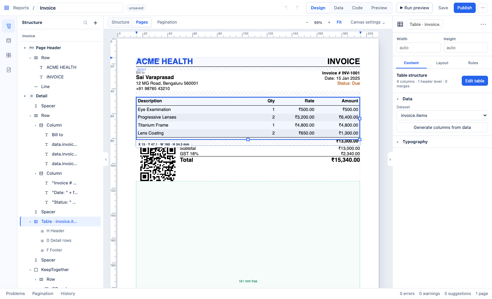
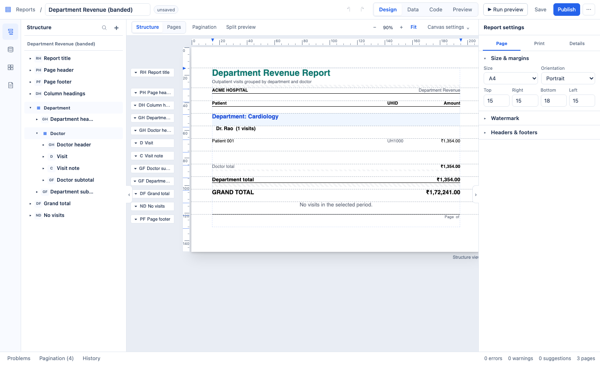
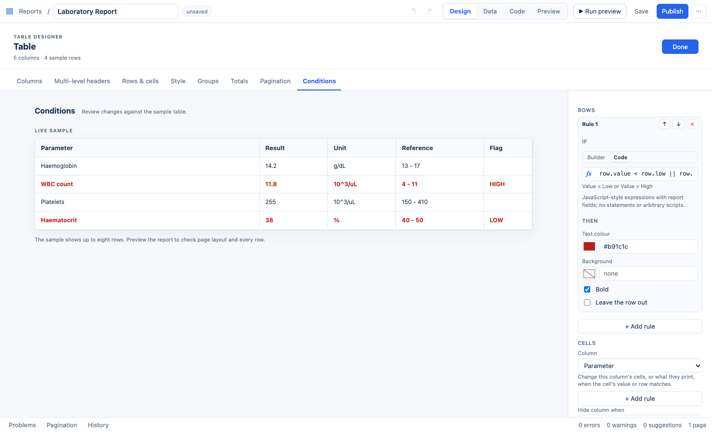
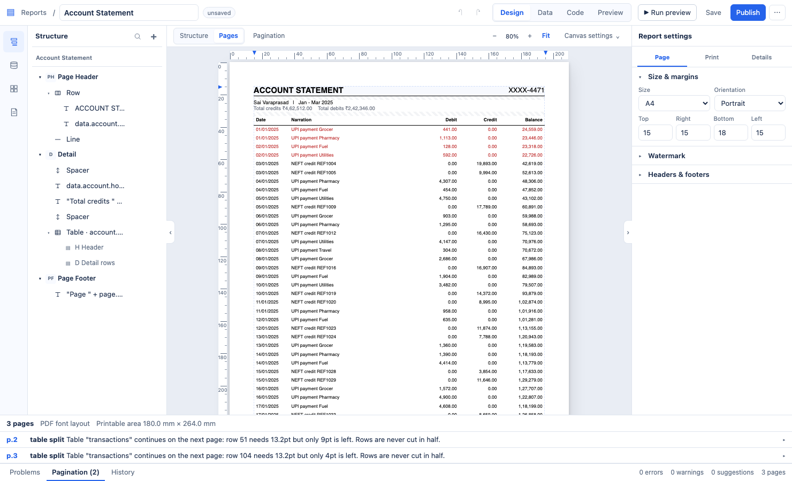
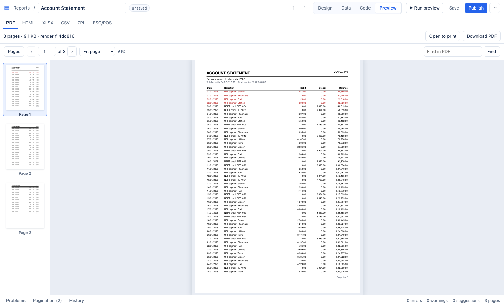
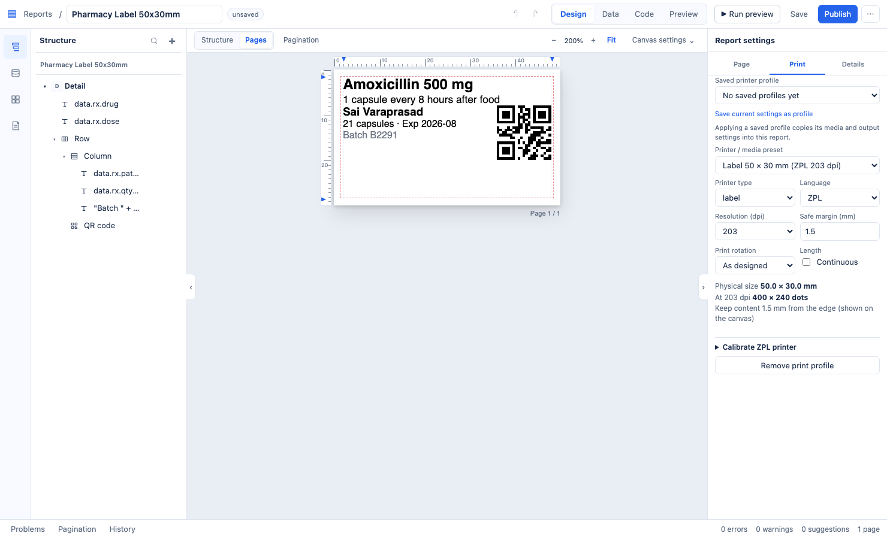
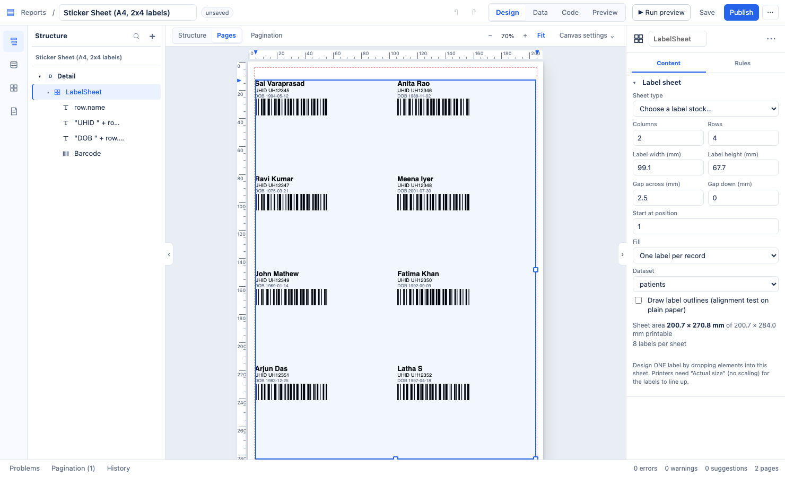
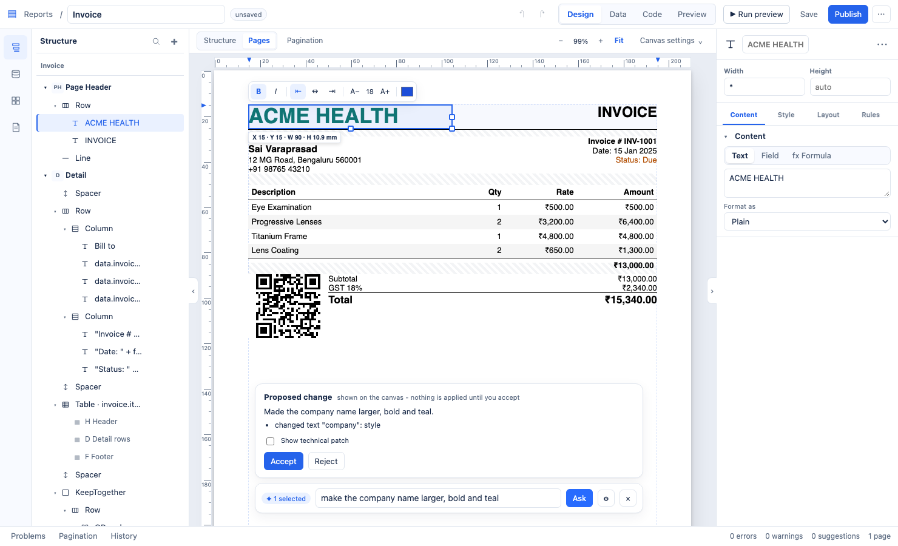

<div align="center">

# Open Reports

**Design data-driven documents in your browser. Render them anywhere.**

Invoices, statements, grouped business reports, labels, receipts and sticker sheets from one template, delivered as PDF, HTML, Excel, CSV, Zebra labels (ZPL) or receipt-printer output (ESC/POS).

Open source (MIT) · self-hosted · no seats, no per-document fees

[Quick start](#quick-start) · [Tour](#a-quick-tour) · [Use it from your app](#use-it-from-your-app) · [Docs](#documentation)



</div>

## Quick start

```bash
git clone https://github.com/varaprasadreddy9676/open-reports.git && cd open-reports
docker compose up --build
```

Open **http://localhost:3000**, pick **Invoice** from the starters, and press **Preview**. You are looking at a real PDF.

No Docker? Node 22 and `pnpm` work too: `pnpm install && pnpm doctor && pnpm build:all && pnpm start` (details in [Getting started](docs/GETTING_STARTED.md)).

## Why Open Reports

| | |
|---|---|
| **A designer anyone can use** | Drag fields from your data onto the page, arrange bands and groups, set conditions with plain expressions. It runs in the browser: nothing to install for report authors. |
| **Pagination you can trust** | Repeating headers, page X of Y, groups that keep together, rows that split cleanly, first/last/odd/even page layouts. When something moves to the next page, the designer tells you why and offers the fix. |
| **One template, every output** | The same report renders to PDF, HTML, Excel and CSV. Label and receipt layouts print to Zebra (ZPL) and thermal (ESC/POS) printers, in real millimetres. |
| **Templates are plain JSON** | Review them in pull requests, generate them from code, edit them with AI. A published JSON Schema documents every field. |
| **Your server, your data** | Self-hosted. Database credentials stay on the server; templates only reference `{{secrets.NAME}}`. Formulas run in a sandbox, never as code. |
| **Easy to move in** | Coming from JasperReports? Import your `.jrxml` files, or a whole folder of them, and keep editing in the designer. [Migration guide](docs/JRXML_MIGRATION.md) |

## A quick tour

**Build the structure your report needs.** Report, page, group and detail bands; nested groups with subtotals; a no-data band; different first and last pages.



**Highlight what matters.** Colour or hide rows, style single cells, print "credit" instead of a negative number, or hide a column for some users. The live sample shows exactly which rows match.



**See why a page broke.** Every page break is explained, with the space that was left and a one-click fix.



**Preview the real thing.** The preview is the actual PDF the server produces: same fonts, same page breaks, searchable text. HTML, Excel, CSV, ZPL and ESC/POS are one tab away.



**Design labels and sticker sheets in physical units.** Set the printer's DPI and safe margins, check barcodes are scannable, fill an A4 sheet of stickers from a list.

<table><tr>
<td></td>
<td></td>
</tr></table>

**Let AI do the tedious edits, safely.** Describe a change; the AI proposes an edit to the template, and you accept or reject it. It never invents numbers: the engine calculates everything. Bring your own key (Claude, OpenAI-compatible or local models), or connect any MCP client.



## What you can build

24 starters ship with the designer. Open one, connect your data, publish.

| Documents | Starters |
|---|---|
| Invoices, purchase orders, statements | `invoice` · `purchase-order` · `account-statement` |
| Grouped and summary reports | `grouped-sales` · `department-report` · `charts` · `conditional` |
| Large exports (100,000+ rows) | `large-dataset` → Excel / CSV |
| Thermal receipts (58 / 80 mm) | `receipt` · `receipt-58mm` |
| Labels, wristbands, ID cards | `label-50x30` · `label-100x50` · `wristband` · `patient-id-card` · `specimen-label` · `pharmacy-label` · `blood-bag-label` |
| Sticker sheets | `sticker-sheet` |
| Long clinical and narrative reports | `lab-report` · `discharge-summary` · `radiology-report` · `prescription` |
| Forms, certificates, multilingual output | `absolute-form` · `multilingual` (Latin, Devanagari, Telugu, Kannada, Tamil, Arabic) |

Step-by-step recipes: [Use cases](docs/USE_CASES.md).

## Use it from your app

Render any template with one HTTP call, from any language:

```bash
curl -X POST http://localhost:4000/api/v1/render \
  -H 'content-type: application/json' \
  -d "{\"format\":\"pdf\",\"report\":$(cat examples/invoice.report.json)}" -o invoice.pdf
```

In production, save and publish templates once, then render them by id with fresh data. Published versions never change, large renders can run as background jobs, and the API is described by OpenAPI at `/openapi.json`. See the [API guide](docs/API.md) for Node, Python, Java, C# and Go snippets.

A report is a readable JSON document:

```json
{
  "schemaVersion": "1.0", "id": "orders", "name": "Orders",
  "datasets": [{ "id": "orders", "source": "rest", "query": { "url": "https://api.example.com/orders" } }],
  "sections": [
    { "type": "pageHeader", "children": [{ "type": "text", "value": "Orders" }] },
    { "type": "detail", "children": [{
      "type": "table", "dataset": "orders", "showFooter": true,
      "rowRules": [{ "when": "row.status == \"overdue\"", "set": { "style.color": "#b91c1c" } }],
      "columns": [
        { "header": "Customer", "binding": "row.customer" },
        { "header": "Amount", "binding": "row.amount", "format": "currency", "footer": { "aggregate": "sum" } }
      ] }] },
    { "type": "pageFooter", "children": [{ "type": "text", "expression": "\"Page \" + page.number + \" of \" + page.total" }] }
  ]
}
```

Data can come from inline JSON, CSV, REST APIs, PostgreSQL or MySQL. Everything else is in the [report definition reference](docs/REPORT_DEFINITION.md).

## Documentation

| | |
|---|---|
| **Start** | [Getting started](docs/GETTING_STARTED.md) · [User guide](docs/USER_GUIDE.md) · [Use cases](docs/USE_CASES.md) · [Migrating from JasperReports](docs/JRXML_MIGRATION.md) |
| **Run** | [Configuration](docs/CONFIGURATION.md) · [Deployment](docs/DEPLOYMENT.md) · [Troubleshooting](docs/TROUBLESHOOTING.md) |
| **Integrate** | [REST API](docs/API.md) · [Report definition](docs/REPORT_DEFINITION.md) · [AI and MCP](docs/AI_AND_MCP.md) |
| **Extend** | [Plugins](docs/PLUGIN_DEVELOPMENT.md) · [Architecture](docs/ARCHITECTURE.md) |

## Quality

Every change runs nearly 1,000 automated tests in CI, against real PostgreSQL and MySQL: pagination boundaries on real PDFs, visual comparisons of rendered reports and of the designer, security tests (formula sandbox, SSRF, injection, path traversal), the MCP server end to end, and over 170 browser tests that drive the designer. As a rough guide, a 100,000-row Excel export takes about 8 seconds on a laptop-class CPU.

## Status

Open Reports is young (v0.x) and moving fast: well tested, but expect rough edges. Not yet supported: PDF/A and digital signatures, crosstabs, and importing Word or InDesign layouts. Page breaks are measured with the bundled Noto fonts, so a different font changes line breaks, and label and receipt output is verified as ZPL and ESC/POS bytes rather than on every printer model. The roadmap lives on the issue tracker.

## Contributing

Bug reports, starter templates for your industry, plugins and documentation fixes are all welcome. Start with [CONTRIBUTING.md](CONTRIBUTING.md); report security issues privately as described in [SECURITY.md](SECURITY.md).

## License

[MIT](LICENSE): free for personal and commercial use.
