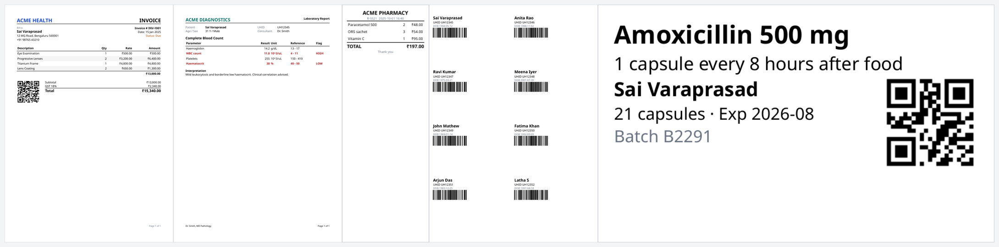

<div align="center">

# Open Reports

### Invoices, clinical reports, receipts, labels and sticker sheets — designed visually, rendered perfectly, owned by you.

**Free · MIT · self-hosted · no per-document fees · no seats · no cloud lock-in**

[60-second start](#-60-second-start) · [Why people switch](#-why-people-switch) · [What you can build](#-what-you-can-build) · [Docs](#-documentation)


</div>

---

## The problem

If you've ever had to generate documents from data, you've probably hit one of these walls:

- 😩 **The "free" tool fights you.** Page breaks land in the wrong place, table headers don't repeat, the last page has one lonely row, Hindi/Telugu/Arabic turns into boxes — and nobody can tell you *why*.
- 💸 **The good tool is expensive.** Per-seat licences, per-document pricing, "enterprise" tiers for the features you actually need (repeating headers, barcodes, label printing), and your templates locked in a format only that vendor can open.
- 🧱 **The DIY route is a trap.** HTML → headless browser → PDF looks fine until you need 100 pages, exact millimetres, a Zebra label, or a receipt printer. Then you're maintaining a pile of CSS hacks and a Chrome install.
- 🔒 **Your data has to leave.** Patient records, invoices and financials sent to a third-party SaaS just to make a PDF.
- 🧩 **One tool per output.** A report engine for PDFs, a separate thing for Excel, another script for labels, another for receipts.

**Open Reports is built to remove those walls.** One report definition → pixel-stable **PDF, HTML, Excel, CSV, Zebra (ZPL) labels and ESC/POS receipts** — from a visual designer a non-developer can use, an API a developer can call, or an AI assistant you control.

## ✨ Why people switch

| You were putting up with… | Here instead |
|---|---|
| Page breaks you can't control or explain | A real pagination engine: repeating headers/footers, "Page X of Y", row splitting, orphan/widow control, keep-together / keep-with-next, different first / last / odd / even pages — and a **"why did this move to the next page?"** panel with one-click fixes |
| Paying per seat / per document / per feature | **MIT licence.** Run it on your laptop, your server or Kubernetes. Unlimited users, templates and documents |
| Separate tools for PDF, Excel, labels, receipts | **One definition, six outputs.** Same template → PDF *and* HTML *and* XLSX/CSV; labels → ZPL; receipts → ESC/POS |
| Templates trapped in a proprietary file | Reports are **plain JSON** with a published JSON Schema. Diff them in git, generate them from code, migrate away any time |
| "It works on my machine" PDFs | **Deterministic.** Same template + data + fonts ⇒ identical pages, every run. Measured with real font metrics, tested on real PDFs |
| Broken Indian-language / Arabic text | Latin, Devanagari, Telugu, Kannada, Tamil and **right-to-left Arabic** out of the box, even mixed in one cell |
| Printing labels meant a separate label-design product | **Label & wristband design built in:** physical mm sizes, DPI, safe margins, scannable-size checks on barcodes/QR, live **ZPL** preview |
| Sticker sheets by trial and error | **Label sheets:** pick "A4 2×4" (or enter columns × rows × mm), fill from your records, start at slot 5 on a half-used sheet |
| Sending sensitive data to a SaaS | **Self-hosted.** Nothing leaves your infrastructure. Credentials stay on the server; reports only reference `{{secrets.NAME}}` |
| Report authors who must write code | **Visual designer + low-code builders** (pick a field, build a calculation or condition from dropdowns). Experts get a schema-aware code editor on the *same* document |
| AI that "just generates a PDF" and gets numbers wrong | **AI edits the template, never the numbers.** Bring your own key (or any MCP client); changes arrive as a reviewable diff. The engine does all the maths and rendering |
| Security worries about report formulas | Formulas run in a **sandboxed interpreter — no `eval`, no code in reports**. SSRF-guarded REST, parameterised SQL, escaped HTML/CSV output, all covered by tests |

> **Honest note:** this is v0.1 software. It is thoroughly tested (see [Quality](#-quality)), but it's young and the community is small. [Where it isn't the right choice](#-is-this-right-for-you) is spelled out below.

## 🚀 60-second start

**Docker** — includes the fonts that make PDFs correct:
```bash
git clone https://github.com/varaprasadreddy9676/open-reports.git && cd open-reports
docker compose up --build
```
Open **http://localhost:3000** → **New report → Invoice** → **Preview**. That's it.

**Without Docker** (Node 22+):
```bash
git clone https://github.com/varaprasadreddy9676/open-reports.git && cd open-reports
corepack enable && pnpm install
pnpm doctor        # checks Node/fonts/tools and tells you exactly how to fix anything missing
pnpm build:all && pnpm start      # → http://localhost:4000 (designer + API)
```

Render from any language with one request:
```bash
curl -X POST localhost:4000/api/v1/render -H 'content-type: application/json' \
  -d "{\"format\":\"pdf\",\"report\":$(cat examples/invoice.report.json)}" -o invoice.pdf
```
> 🔐 With no `API_KEYS` set the server is open (and warns you). Perfect for trying it; set `API_KEYS=yoursecret` before exposing it. → [Deployment](docs/DEPLOYMENT.md)

## 🧰 What you can build

23 ready-made starters in the designer's **New report** dialog — open one, swap in your data, done:



| I want to… | Start from | Output |
|---|---|---|
| Send invoices, purchase orders, statements | `invoice` · `purchase-order` · `account-statement` | PDF · HTML |
| Produce long reports with repeating headers and page numbers | `lab-report` · `discharge-summary` · `radiology-report` · `prescription` | PDF |
| Print 58/80 mm thermal receipts | `receipt` · `receipt-58mm` | PDF or raw **ESC/POS** |
| Print labels, wristbands, ID cards on Zebra printers | `specimen-label` · `pharmacy-label` · `blood-bag-label` · `wristband` · `label-50x30` · `label-100x50` | **ZPL** or PDF |
| Print **sheets of stickers** (e.g. 8 per A4) from a list | `sticker-sheet` | PDF |
| Export 100 000+ rows to Excel/CSV | `large-dataset` | XLSX · CSV |
| Charts, grouping, conditional highlighting | `charts` · `grouped-sales` · `conditional` | PDF · HTML |
| Multilingual documents | `multilingual` | PDF |
| Pixel-placed forms and certificates | `absolute-form` | PDF |

Step-by-step recipes: **[docs/USE_CASES.md](docs/USE_CASES.md)**.

### Design the report's structure — bands, groups, rulers, guides


Reports are built from real **bands** (report/page/group/data headers and footers, detail, child, no-data, background) that the engine understands — nested groups, repeated group headers, keep-together and page-break rules all work in the PDF, not just on the canvas. Millimetre/inch/point rulers, draggable margins, persistent guides, band resize/collapse/reorder, and a *Structure ⇄ Pages* switch.

### See *why* a page broke — and fix it in one click


### Design labels and sticker sheets in physical units
<table><tr>
<td></td>
<td></td>
</tr></table>

### Let AI help — safely

The AI sees only what you select, returns a JSON edit, and you **Accept** or **Reject** it as a diff. Your API key stays in your browser; sample data values are never sent. Works with Claude, any OpenAI-compatible endpoint (including local models), and — through the MCP server — Claude Desktop/Code, Cursor, Codex and friends. → [AI & MCP](docs/AI_AND_MCP.md)

## 🧭 How it works

```
 Report Definition (one JSON file)
        │  parameters → datasets → formulas → pagination → renderers
        ▼
  PDF · HTML · XLSX · CSV · ZPL · ESC/POS · (your plugin)
```
- **One model, three ways to edit it** — visual designer, low-code builders, code editor — always in sync.
- **Data stays outside the report** — inline JSON, CSV, REST APIs, PostgreSQL, MySQL. Credentials never enter the template.
- **Extensible** — plugins add output formats, data sources, formula functions, reusable components, even storage backends.

## 🔌 Use it from your app

```bash
# store + publish a template once (the designer's Save/Publish buttons do the same)
curl -X POST $URL/api/v1/templates -H "x-api-key: $KEY" -H 'content-type: application/json' \
  -d "{\"id\":\"invoice\",\"name\":\"Invoice\",\"definition\":$(cat examples/invoice.report.json)}"
curl -X POST $URL/api/v1/templates/invoice/versions/1/publish -H "x-api-key: $KEY"

# render it for any record, any time
curl -X POST $URL/api/v1/templates/invoice/render -H "x-api-key: $KEY" -H 'content-type: application/json' \
  -d '{"format":"pdf","data":{"invoice":{"number":"INV-7","customer":{"name":"Asha"},"items":[{"description":"Consult","quantity":1,"rate":500}]}}}' -o inv7.pdf
```
Versioned templates (published versions are immutable), async jobs for big renders, OpenAPI at `/openapi.json`. Snippets for Node, Python, Java, C# and Go: **[docs/API.md](docs/API.md)**.

## 🤔 Is this right for you?

**Great fit if** you generate business or clinical documents from data; need correct multi-page output; print labels/receipts; want to self-host; or are tired of per-document/per-seat pricing.

**Probably not (yet) if** you need: pixel-perfect round-tripping of arbitrary Word/InDesign layouts; PDF/A archiving or digital signatures *(roadmap)*; a hosted SaaS with vendor support/SLA; or an off-the-shelf BI dashboard tool (this makes *documents*, not interactive dashboards).

## 📚 Documentation

| | |
|---|---|
| **Start** | [Getting started (15 min)](docs/GETTING_STARTED.md) · [User guide](docs/USER_GUIDE.md) · [Use-case recipes](docs/USE_CASES.md) |
| **Run** | [Configuration & env vars](docs/CONFIGURATION.md) · [Deployment](docs/DEPLOYMENT.md) · [Troubleshooting & FAQ](docs/TROUBLESHOOTING.md) |
| **Integrate** | [REST API](docs/API.md) · [Report definition reference](docs/REPORT_DEFINITION.md) · [AI & MCP](docs/AI_AND_MCP.md) |
| **Extend** | [Plugins](docs/PLUGIN_DEVELOPMENT.md) · [Architecture](docs/ARCHITECTURE.md) |
| **Project** | [Contributing](CONTRIBUTING.md) · [Security](SECURITY.md) · [Code of Conduct](CODE_OF_CONDUCT.md) · [Changelog](CHANGELOG.md) |

## ✅ Quality

Trust is earned with tests, so there are a lot (~400):
- **Pagination boundary suite** on real PDFs (N−1 / N / N+1 rows, multi-page, other page sizes, wrapped and multi-script cells)
- **Visual regression** against committed baselines of the sample reports
- **Security suite:** formula sandbox, SSRF, SQL/HTML/CSV/ZPL injection, path traversal, prototype pollution, auth
- **Real databases:** PostgreSQL and MySQL integration tests
- **AI/MCP end-to-end:** a real MCP client against the real server
- **~95 browser tests** driving the designer; a scripted "hospital day" demo (templates → versions → PDF/ZPL/XLSX/CSV, 100 000-row export)
- Indicative speed on a laptop-class CPU (`pnpm --filter @reporting/server bench`): 100 000-row XLSX ≈ 8 s · 100 000-row CSV ≈ 5 s · 2 000-row PDF ≈ 0.8 s

CI (`.github/workflows/ci.yml`) runs all of it against real PostgreSQL and MySQL.

## 🗺️ Status and roadmap

**Works today:** six outputs · pagination engine · banded designer (structure/pages views, rulers, guides, nested groups, design / data / code / preview, layers, page layouts, print profiles, label sheets, embedded or linked logos) · versioned template server · plugins · MCP server · designer AI bar · Docker · CI.

**Next** (contributions welcome — issues labelled `roadmap`): typed SDKs + CLI · PDF/A and digital signatures · footnotes and automatic table of contents · EPL output · streaming for million-row exports · subreports · advanced typography.

**Known limits:** tall side-by-side rows are not yet split across pages; physical printer output (Zebra/receipt) is verified as PDF/ZPL bytes, not on real hardware; visual baselines are pinned to the Linux CI font setup; pagination matches the bundled Noto fonts (another font changes line breaks); ZPL uses the printer's built-in Latin fonts (print other scripts as PDF); plugin components preview in *Preview* rather than on the canvas.

## 🤝 Contributing

Bug reports, templates, plugins and doc fixes are all welcome — **a good first contribution is a new starter template for your industry.** Start with [CONTRIBUTING.md](CONTRIBUTING.md) (`pnpm doctor` first). Security issues: [SECURITY.md](SECURITY.md). Be kind: [Code of Conduct](CODE_OF_CONDUCT.md).

If this saves you from a painful tool or a painful invoice, a ⭐ helps others find it.

## License

MIT — free for personal and commercial use. See [LICENSE](LICENSE).
