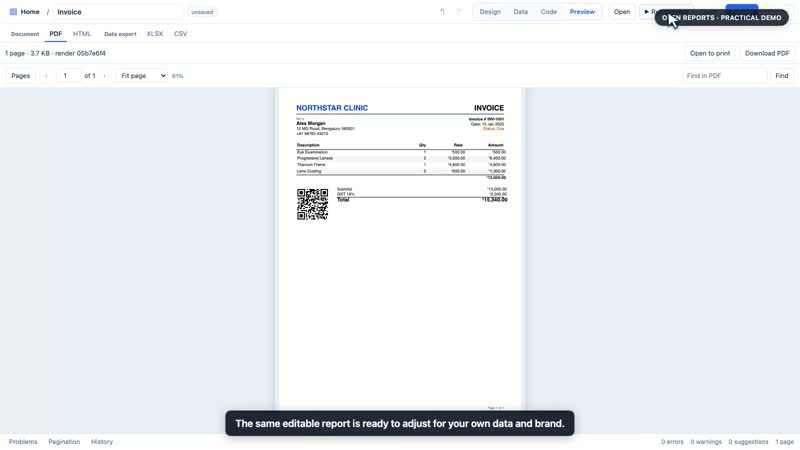

<div align="center">

# Open Reports

**Design data-driven documents in your browser. Render them anywhere.**

Design invoices, statements, grouped reports, crosstabs, labels, receipts and sticker sheets. Render PDF or HTML, export an editable Word document, export data as Excel or CSV, and create printer-specific ZPL or ESC/POS output.

Open source (MIT) · self-hosted · no seats, no per-document fees

[Try the live demo](https://open-reports-demo.onrender.com) · [Quick start](#quick-start) · [Tour](#a-quick-tour) · [Use it from your app](#use-it-from-your-app) · [Docs](#documentation) · [Give feedback](https://github.com/varaprasadreddy9676/open-reports/issues/new?template=1-feedback.yml)

[](https://codespaces.new/varaprasadreddy9676/open-reports) [](https://render.com/deploy?repo=https://github.com/varaprasadreddy9676/open-reports)

[](https://open-reports-demo.onrender.com/?tour=1)

**[Browse practical product videos in the demo](https://open-reports-demo.onrender.com/?tour=1)** · [Watch the launch film](https://www.youtube.com/watch?v=_7LTG0cLO80)

</div>

## Quick start

**Want to try it first?** [Open the live demo](https://open-reports-demo.onrender.com), choose **Invoice**, change something, and press **Preview**. It runs on a free instance, so the first load after inactivity can take about a minute. The demo is shared and resets; use sample data only.

Choose **Practical videos** on Home to watch real browser recordings: edit an invoice and preview its PDF, import a Word template, migrate a JRXML folder, print a long 58 mm grocery receipt, and summarize data with a crosstab. Captions are included in each video.

```bash
git clone https://github.com/varaprasadreddy9676/open-reports.git && cd open-reports
docker compose up --build
```

Open **http://localhost:3000**, pick **Invoice** from the starters, and press **Preview**. You are looking at a real PDF.

Nothing to install: open it in **GitHub Codespaces** (button above; the app opens in your browser after a few minutes of setup), or deploy your own free demo with **Deploy to Render**.

No Docker? Node 22 and `pnpm` work too: `pnpm install && pnpm doctor && pnpm build:all && pnpm start` (details in [Getting started](docs/GETTING_STARTED.md)).

### Pick the task you have

The demo's **What can I do?** guide explains these workflows and opens the right starting point.

| I want to… | Why it helps | First step |
|---|---|---|
| Reuse a Word form or letterhead | Start from familiar content, then connect it to data | **Import Word document** on Home; review the conversion notes |
| Move a JasperReports design | Keep the JRXML structure as an editable draft | **Import JRXML** on Home; review migration issues |
| Compare totals across categories | A crosstab turns rows into a region-by-service summary | Open the **Sales by region and service** example |
| Give someone an editable document | DOCX keeps text, tables and supported charts editable | Open a report → **⋯ → Export → Word (DOCX)** |
| Let readers search and sort a report | The published viewer provides find, contents, sorting and report links | [Publish and embed a report](docs/EMBEDDING.md) |
| Show reports inside my app | Use the viewer or designer without building a reporting screen | [Copy the embed snippet](docs/EMBEDDING.md) |

## Why Open Reports

| | |
|---|---|
| **A designer anyone can use** | Drag fields from your data onto the page, arrange bands and groups, set conditions with plain expressions. It runs in the browser: nothing to install for report authors. |
| **Pagination you can inspect** | Repeating headers, page X of Y, group and row pagination, and first/last/odd/even page layouts. The designer shows page-break diagnostics so you can review where content moved. |
| **Several output formats** | Render reports as PDF or HTML, export data as Excel or CSV, and design printer-specific layouts for Zebra (ZPL) and thermal (ESC/POS) printers in real millimetres. |
| **Templates are plain JSON** | Review them in pull requests, generate them from code, edit them with AI. A published JSON Schema documents every field. |
| **Your server, your data** | Self-hosted. Database credentials stay on the server; templates only reference `{{secrets.NAME}}`. Formulas run in a sandbox, never as code. |
| **Bring in JRXML source** | Import one `.jrxml` file or a folder as editable drafts. The importer lists features that need review; data bindings and PDF output must be checked before production use. [Migration guide](docs/JRXML_MIGRATION.md) |

## A quick tour


**Build the structure your report needs.** Report, page, group and detail bands; nested groups with subtotals; a no-data band; different first and last pages.


**Highlight what matters.** Colour or hide rows, style single cells, print "credit" instead of a negative number, or hide a column for some users. The live sample shows exactly which rows match.


**Inspect page breaks.** Pagination diagnostics show why content moved, including the space left on the page, and offer fixes for supported cases.


**Preview the real thing.** The preview is the actual PDF the server produces: same fonts, same page breaks, searchable text. HTML, Excel, CSV, ZPL and ESC/POS are one tab away.


**Design labels and sticker sheets in physical units.** Set the printer's DPI and safe margins, check barcodes are scannable, fill an A4 sheet of stickers from a list.

<table><tr>
<td></td>
<td></td>
</tr></table>

**Let AI do the tedious edits, safely.** Describe a change; the AI proposes an edit to the template, and you accept or reject it. It never invents numbers: the engine calculates everything. Bring your own key (Claude, OpenAI-compatible or local models), or connect any MCP client.


## What you can build

25 starters ship with the designer. Open one, connect your data, publish.

| Documents | Starters |
|---|---|
| Invoices, purchase orders, statements | `invoice` · `purchase-order` · `account-statement` |
| Grouped and summary reports | `grouped-sales` · `department-report` · `crosstab` · `charts` · `conditional` |
| Large exports (100,000+ rows) | `large-dataset` → Excel / CSV |
| Thermal receipts (58 / 80 mm) | `receipt` · `receipt-58mm` |
| Labels, wristbands, ID cards | `label-50x30` · `label-100x50` · `wristband` · `patient-id-card` · `specimen-label` · `pharmacy-label` · `blood-bag-label` |
| Sticker sheets | `sticker-sheet` |
| Long clinical and narrative reports | `lab-report` · `discharge-summary` · `radiology-report` · `prescription` |
| Forms, certificates, multilingual output | `absolute-form` · `multilingual` (Latin, Devanagari, Telugu, Kannada, Tamil, Arabic) |

Step-by-step recipes: [Use cases](docs/USE_CASES.md).

## Use it from your app

Drop a report viewer or the whole designer into your own pages, in any framework:

```html
<script type="module" src="http://localhost:4000/embed/open-reports.js"></script>
<open-report-viewer template="invoice" parameters='{"invoiceId": 1042}'></open-report-viewer>
<open-report-designer template="invoice"></open-report-designer>
```

The viewer shows a parameter form with Refresh, Print and PDF/Excel/CSV downloads; the designer reports saves back to your page. See [Embedding](docs/EMBEDDING.md).

Or render any template with one HTTP call, from any language:

```bash
curl -X POST http://localhost:4000/api/v1/render \
  -H 'content-type: application/json' \
  -d "{\"format\":\"pdf\",\"report\":$(cat examples/invoice.report.json)}" -o invoice.pdf
```

In production, save and publish templates once, then render them by id with fresh data. Published versions never change, large renders can run as background jobs, and the API is described by OpenAPI at `/openapi.json`. See the [API guide](docs/API.md) for Node, Python, Java, C# and Go snippets.

A report is a readable JSON document:

```json
{
  "schemaVersion": "1.0", "id": "orders", "name": "Orders",
  "datasets": [{ "id": "orders", "source": "rest", "query": { "url": "https://api.example.com/orders" } }],
  "sections": [
    { "type": "pageHeader", "children": [{ "type": "text", "value": "Orders" }] },
    { "type": "detail", "children": [{
      "type": "table", "dataset": "orders", "showFooter": true,
      "rowRules": [{ "when": "row.status == \"overdue\"", "set": { "style.color": "#b91c1c" } }],
      "columns": [
        { "header": "Customer", "binding": "row.customer" },
        { "header": "Amount", "binding": "row.amount", "format": "currency", "footer": { "aggregate": "sum" } }
      ] }] },
    { "type": "pageFooter", "children": [{ "type": "text", "expression": "\"Page \" + page.number + \" of \" + page.total" }] }
  ]
}
```

Data can come from inline JSON, CSV, REST APIs, PostgreSQL or MySQL. Everything else is in the [report definition reference](docs/REPORT_DEFINITION.md).

## Documentation

| | |
|---|---|
| **Start** | [Getting started](docs/GETTING_STARTED.md) · [User guide](docs/USER_GUIDE.md) · [Use cases](docs/USE_CASES.md) · [Migrating from JasperReports](docs/JRXML_MIGRATION.md) |
| **Run** | [Configuration](docs/CONFIGURATION.md) · [Deployment](docs/DEPLOYMENT.md) · [Troubleshooting](docs/TROUBLESHOOTING.md) |
| **Integrate** | [Embedding](docs/EMBEDDING.md) · [REST API](docs/API.md) · [Report definition](docs/REPORT_DEFINITION.md) · [AI and MCP](docs/AI_AND_MCP.md) |
| **Extend** | [Plugins](docs/PLUGIN_DEVELOPMENT.md) · [Architecture](docs/ARCHITECTURE.md) |

## Quality

The [CI workflow](.github/workflows/ci.yml) runs unit, integration, browser and visual tests, exercises PostgreSQL and MySQL, builds the Docker image, and runs a quick benchmark. These checks cover rendering, pagination, data sources and security boundaries; verify each report with its own data and target printer before relying on its output.

## Status

Open Reports is young (v0.x) and moving fast: expect rough edges. Not yet supported: PDF/A and digital signatures, and importing Word or InDesign layouts. JRXML import creates drafts, not guaranteed Jasper-equivalent PDFs. Page breaks are measured with the bundled Noto fonts, so a different font changes line breaks; label and receipt output is verified as ZPL and ESC/POS bytes rather than on every printer model. The roadmap lives on the issue tracker.

## Tried it? Tell us

Two minutes of feedback shapes what gets built next: [share what you tried, what worked and where you got stuck](https://github.com/varaprasadreddy9676/open-reports/issues/new?template=1-feedback.yml). You can also use **More → Send feedback** inside the app.

## Contributing

Bug reports, starter templates for your industry, plugins and documentation fixes are all welcome. Start with [CONTRIBUTING.md](CONTRIBUTING.md); report security issues privately as described in [SECURITY.md](SECURITY.md).

## License

[MIT](LICENSE): free for personal and commercial use.
